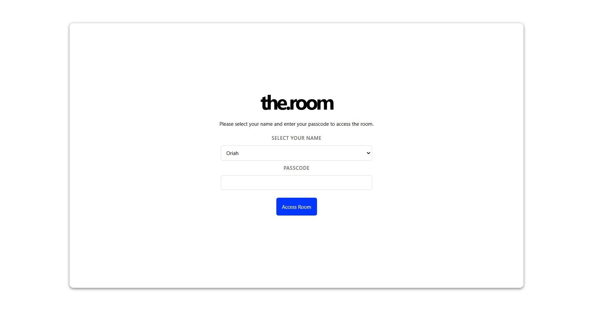
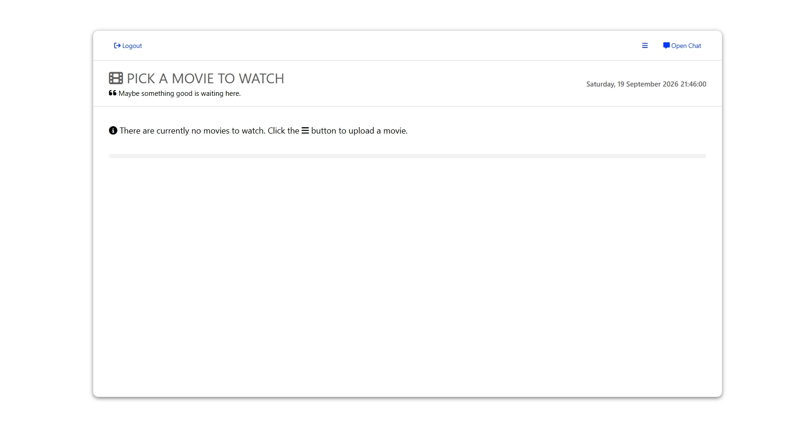
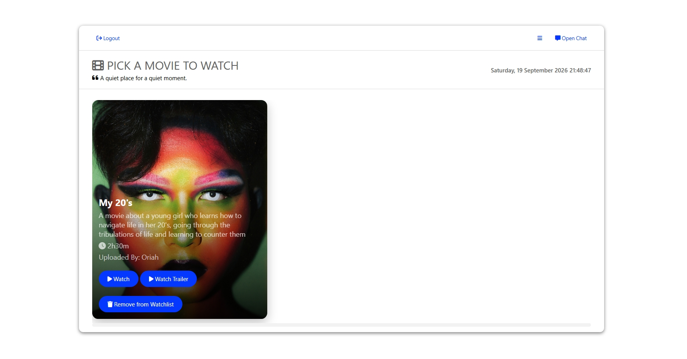
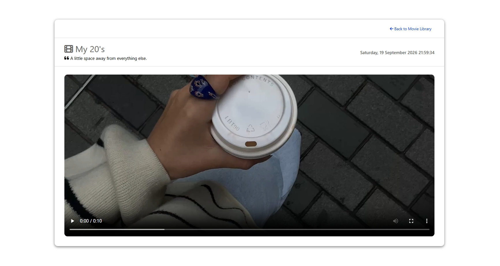
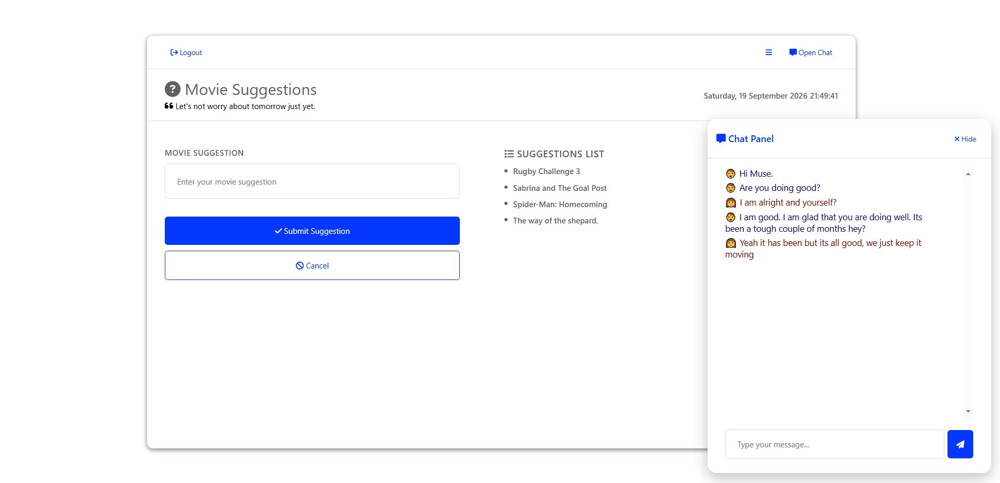
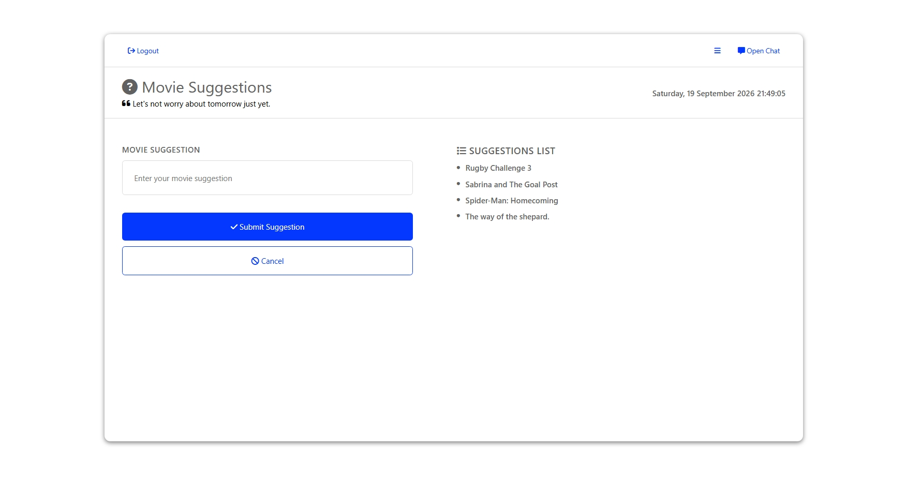

# the.room

**the.room** is a private two-person movie-watching web application built for shared viewing, real-time interaction, and a simple personal media library.

The application allows two authenticated users to access a shared movie collection, watch movies together with synchronized playback, exchange persistent chat messages, and manage movies and suggestions from within the application.

## Features

- Two-user authentication with password hashing
- Protected application routes using Flask-Login
- Shared movie library
- Movie uploads with thumbnails and metadata
- Dedicated movie-watching pages
- Real-time synchronized movie playback
- Play, pause, and seek synchronization
- Persistent chat history stored in the database
- Real-time chat using Socket.IO
- Message timestamps
- User-specific chat indicators and colours
- Movie suggestions
- Flash notifications
- Database migrations with Flask-Migrate
- Local Font Awesome assets
- Separate frontend, media, and migration structure

## Screenshots

NB! Populated data is meant for demonstration purposes.

### Access



### Empty State Movie Library



### Populated Movie Library



### Watch Experience



### Chat



### Movie Suggestions



## Technology Stack

### Backend

- Python
- Flask
- Flask-SQLAlchemy
- Flask-Migrate
- Flask-Login
- Flask-SocketIO
- python-dotenv

### Frontend

- HTML
- CSS
- JavaScript
- Font Awesome

### Database

- SQLite
- SQLAlchemy
- Alembic through Flask-Migrate

### Media

- Pillow
- Local movie and thumbnail storage

## Application Architecture

the.room uses a traditional Flask application structure with server-rendered HTML and JavaScript handling interactive functionality in the browser.

```text
Browser
   │
   ├── HTML / CSS / JavaScript
   │
   ├── HTTP requests
   │
   └── Socket.IO events
          │
          ▼
       Flask
          │
          ├── Authentication
          ├── Movie management
          ├── Suggestions
          ├── Chat
          └── Playback synchronization
          │
          ▼
      SQLAlchemy
          │
          ▼
       SQLite
```

Socket.IO is used for functionality that needs real-time communication between the two connected users, while the database remains the source of truth for persistent information such as users and chat messages.

## Authentication

the.room uses Flask-Login to manage authenticated sessions.

There are two users in the application:

- Oriah
- Muse

Passwords are not stored directly. Passwords are hashed using Werkzeug's password hashing functionality and stored as hashes in the database.

Protected routes require an authenticated user before they can be accessed.

Authentication credentials are supplied through environment variables during database seeding rather than being stored directly in the source code.

## Movie System

Movies are represented by database records containing information such as:

- Title
- Description
- Duration
- Thumbnail
- Movie filename
- Trailer
- Upload information
- Upload timestamp

Uploaded movies and thumbnails are stored locally while their associated metadata is stored in SQLite.

The application provides dedicated routes for accessing uploaded movie files and thumbnails.

## Synchronized Movie Playback

One of the main features of the.room is synchronized movie playback.

When one user performs an action such as:

- Play
- Pause
- Seek

the browser emits a Socket.IO event to the Flask server.

The server broadcasts the event to the other connected user, allowing both users' movie players to remain synchronized.

The synchronization system is intentionally lightweight and uses Socket.IO rather than repeatedly polling the server.

## Persistent Chat

Chat messages are stored permanently in the database.

Each message is associated with a user and contains:

- Sender
- Message content
- Creation timestamp

When a user sends a message:

```text
Browser
   │
   │ send_message
   ▼
Socket.IO
   │
   ▼
Flask
   │
   ├── Save message to database
   │
   └── Broadcast message
           │
           ▼
       Other user
```

When the application loads, the existing conversation is retrieved from the database so that messages remain available after refreshing the page, closing the browser, logging out, or logging back in.

## Movie Suggestions

Users can submit movie suggestions through the application.

Suggestions are stored in the database so they can be retained independently from the movie library.

## Database

The application uses SQLAlchemy for database interaction and Flask-Migrate for schema migrations.

Current core models include:

- `User`
- `Movie`
- `Suggestions`
- `Message`

Database changes are tracked through migration files stored in:

```text
migrations/versions/
```

A new environment can recreate the database schema by applying the existing migrations.

## Project Structure

```text
the.room/
│
├── app.py
├── seed.py
├── requirements.txt
├── .gitignore
├── README.md
│
├── migrations/
│   ├── alembic.ini
│   ├── env.py
│   ├── README
│   ├── script.py.mako
│   └── versions/
│
├── static/
│   ├── css/
│   │   └── style.css
│   ├── images/
│   ├── fontawesome-free-6.7.2-web/
│   └── js/
│       └── app.js
│
├── templates/
│   ├── access.html
│   ├── index.html
│   ├── suggestions.html
│   ├── upload.html
│   └── watch.html
│
└── media/
    ├── movies/
    └── thumbnails/
```

The local SQLite database is stored in the `instance/` directory and is excluded from version control.

Movie uploads and generated thumbnails are also excluded from version control.

## Installation

Clone the repository and create a Python virtual environment:

```bash
python -m venv .venv
```

Activate the virtual environment.

On Windows:

```powershell
.venv\Scripts\Activate.ps1
```

Install the project dependencies:

```bash
pip install -r requirements.txt
```

## Environment Variables

Create a `.env` file in the project root.

The application requires environment-specific configuration including:

```text
SECRET_KEY=
SQLALCHEMY_DATABASE_URI=
ORIAH_PASSCODE=
MUSE_PASSCODE=
```

Do not commit `.env` to the repository.

The `.env` file is intentionally excluded through `.gitignore`.

## Database Setup

After configuring the environment:

```bash
flask db upgrade
```

To seed the two application users:

```bash
python seed.py
```

## Running the Application

Start the application with:

```bash
python app.py
```

The application can then be accessed through the local Flask server.

## Security Considerations

The project uses several security measures appropriate for its current scope:

- Password hashing rather than plaintext password storage
- Flask-Login for authenticated sessions
- Login protection on application routes
- Environment variables for secrets and credentials
- `.gitignore` rules preventing sensitive local files from being committed
- Database migrations for controlled schema changes

The application is designed as a private two-user system rather than a public multi-user platform.

## Current Scope

the.room was intentionally designed around a small, private shared experience rather than a general-purpose streaming or social platform.

The current scope focuses on:

1. Authentication
2. Shared movie management
3. Synchronized movie playback
4. Persistent chat
5. Movie suggestions

Voice and video communication experiments were explored during development but are not part of the current active feature set.

## Author

**Molefe Ramotsepane**

Developed as part of the work of **oriah.studios**.
